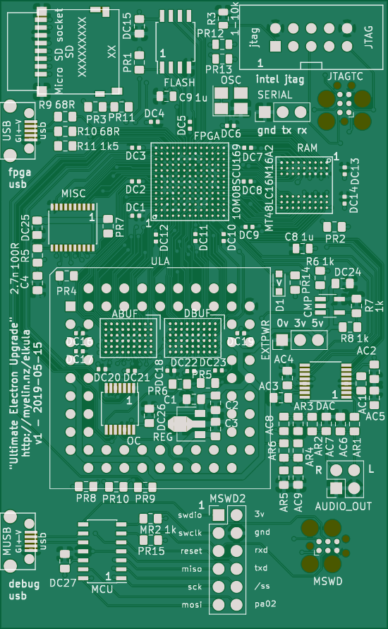
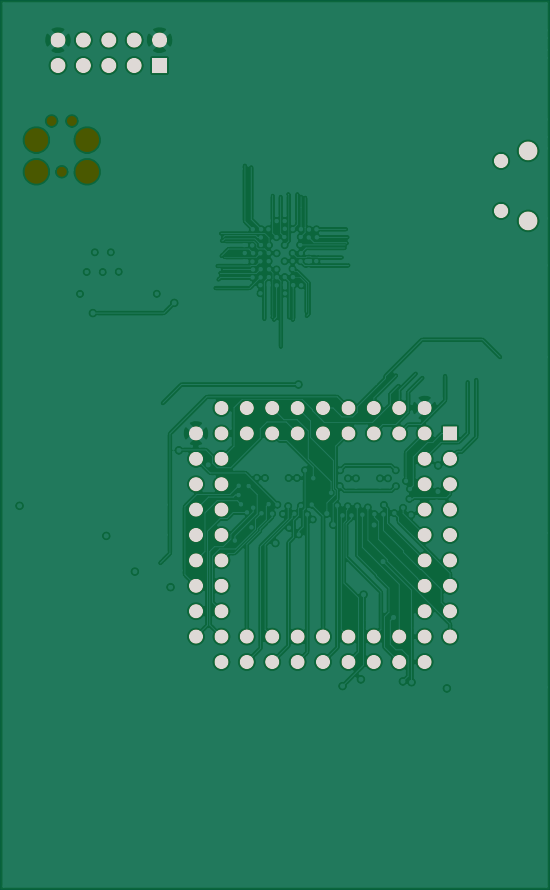

# ElectronFpga/pcb

This is a start at a PCB for the Electron ULA replacement project.

Help welcome/wanted!  Open the .pro file in KiCad then open the PCB to see
progress so far, and check in on the Stardot thread:
https://stardot.org.uk/forums/viewtopic.php?f=3&t=9223

TO DO
-----

- Make a KiCad footprint for the ULA, referring to dimensions in Dave Hitchins' DXF -- https://stardot.org.uk/forums/viewtopic.php?f=3&t=9223&start=180#p208507

- Check that the bounding box is OK.  Right now it's 50 mm x 50 mm, to keep costs down (JLCPCB will do a 4-layer prototype run for $12 at this size).

- Add ULA to the netlist file (max10_electron_ula.py) -- refer to Electron schematic at http://www.acornatom.nl/hardware/Electron-iss4.png

- Figure out what buffers we need.  Which ULA pins are inputs, outputs, open collector?

- Figure out what extra components might be handy.  Memory - flash/RAM?  SD socket?

Pictures
--------

